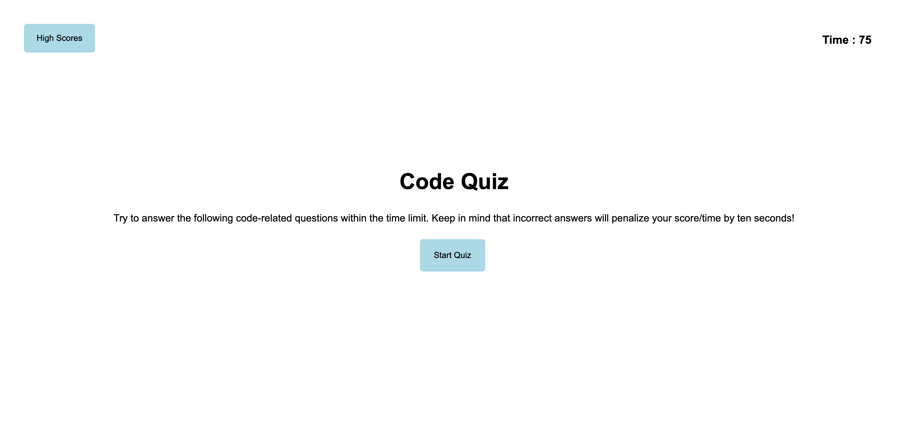

# code-quiz

This project is a part up a homework assignment with MSU Coding Bootcamp. I was given the challenge of creating a code quiz using HTML, CSS and Javascript. 

In this project, multiple choice questions about code are presented and the user must go through the quiz till they reach the end. With every wrong answer selected, 15 seconds will subtract from the timer. The time left at the end of the quiz should be the user's final score. 

This was a very challenging project for me, and definitely showed me I still have a lot to learn! I'm proud that I tried my best though and that I seeked help from tutors and intructors when I felt lost. In the future, I hope to have the skills and abilities to finish this quiz and develop more in my Javascrip skills. 

To view the code quiz that I have, you can reference the links below: 

https://camryngoins.github.io/code-quiz/

https://github.com/camryngoins/code-quiz

## Screenshot:

